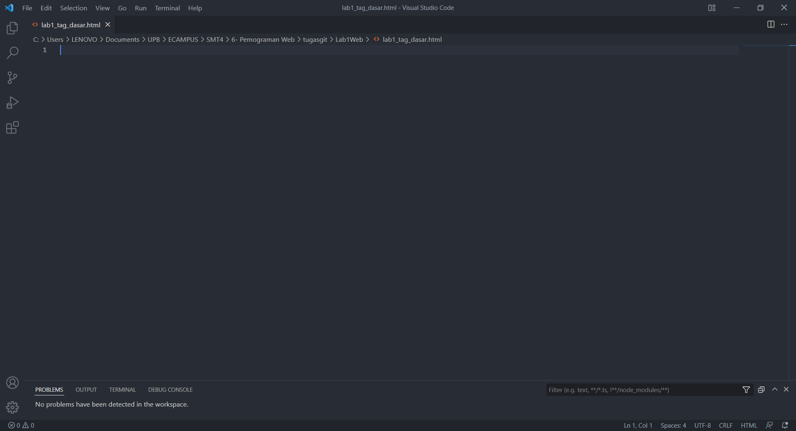

# LAB1 Web

<table border="2" cellpading="10">
  <tr>
    <td><b>Nama</b></td>
    <td>Ilham Nur Utomo</td>
  </tr>
  <tr>
    <td><b>NIM</b></td>
    <td>312010129</td>
  </tr>
  <tr>
    <td><b>Kelas</b></td>
    <td>TI.20.A1</td>
  </tr>
  <tr>
    <td><b>MataKuliah</b></td>
    <td>Pemrograman Web</td>
  </tr>
</table>

# <b>Praktikum</b>
## <b>Text editor dan browser</b>
- Berikut adalah tampilan text editor <i>(VScode)</i> dan browser <i>(Microsoft Edge)</i> yang saya gunakan.

- Memasukan perintah dasar <b>HTML</b>.

### <b>1. Membuat Paragraf</b>

- center right

- justify left

- right center

### <b>2. Menambahkan Judul</b>
- <i>H1 dan H2, dengan menghapus tag align</i>

### <b>3. Memformat Teks</b>
- Menggunakan tag ``<mark>``,``<b>``,``<i>``,dan ``<ins>``

- Mencoba beberapa tag, dengan paragraf baru

### <b>4. Menyisipkan Gambar</b>
