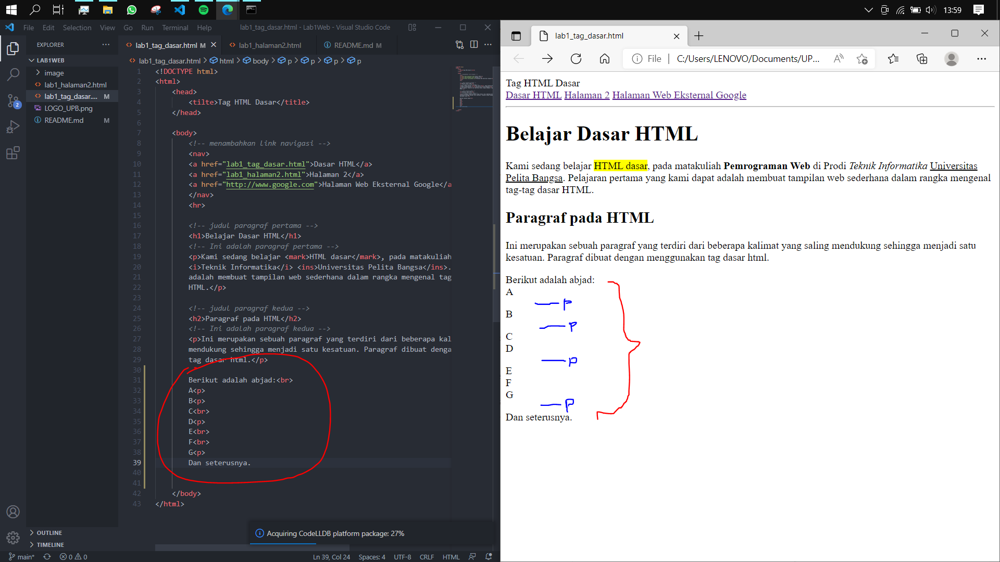
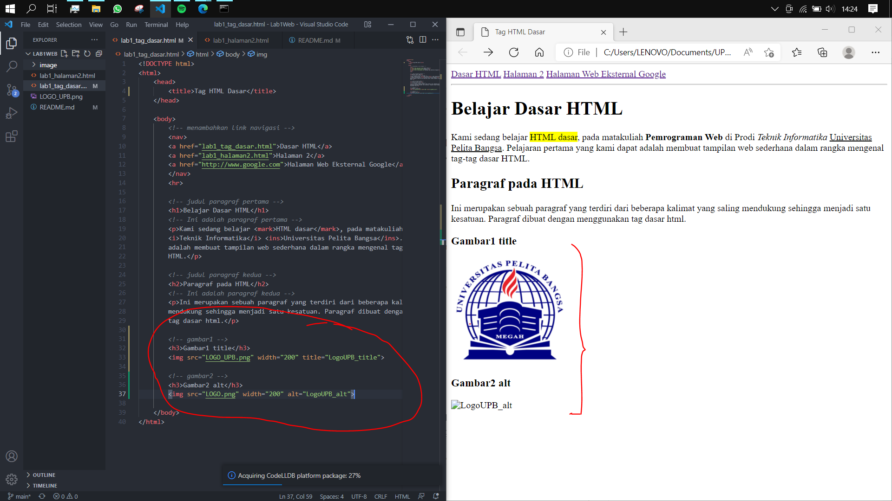
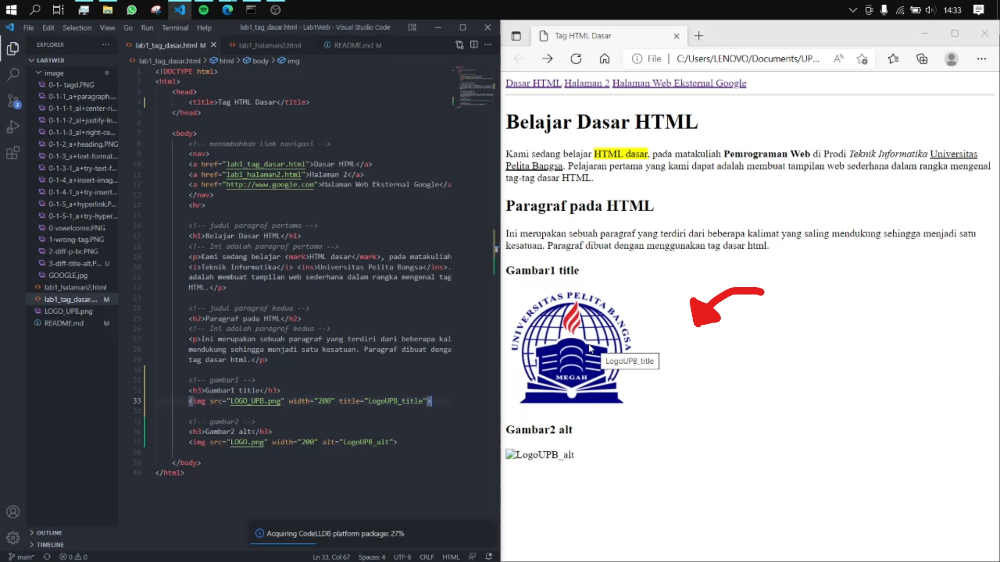
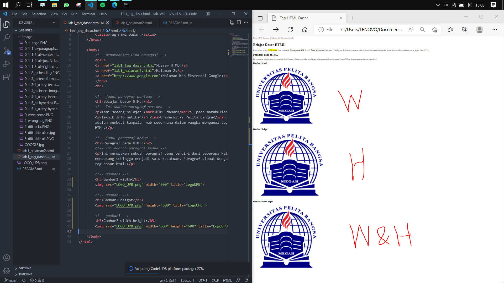

# LAB1 Web

<table border="2" cellpading="10">
  <tr>
    <td><b>Nama</b></td>
    <td>Ilham Nur Utomo</td>
  </tr>
  <tr>
    <td><b>NIM</b></td>
    <td>312010129</td>
  </tr>
  <tr>
    <td><b>Kelas</b></td>
    <td>TI.20.A1</td>
  </tr>
  <tr>
    <td><b>MataKuliah</b></td>
    <td>Pemrograman Web</td>
  </tr>
</table>

# <b>Praktikum</b>

## <b>Text editor dan browser</b>
- Berikut adalah tampilan text editor <i>(VScode)</i> dan browser <i>(Microsoft Edge)</i> yang saya gunakan.

- Memasukan perintah dasar <b>HTML</b>.


### <b>1. Membuat Paragraf</b>

- center right

- justify left

- right center


### <b>2. Menambahkan Judul</b>
- <i>H1 dan H2, dengan menghapus tag align</i>


### <b>3. Memformat Teks</b>
- Menggunakan tag ``<mark>``,``<b>``,``<i>``,dan ``<ins>``

- Mencoba beberapa tag, dengan paragraf baru


### <b>4. Menyisipkan Gambar</b>

- Menambahkan atribut ``width`` untuk menyesuaikan ukuran


### <b>5. Menambahkan Hyperlink</b>

- Tampilan halaman 2


## Latihan
<b>1. 1akukan perubahan pada kode sesuai dengan keinginan anda, amati perubahannya adakah error ketika terjadi kesalahan penulisan tag?</b>
  - Jawaban = Ya, akan berubah. Seperti berikut:
  Sebelum
  
  <br>Sesudah
  
  - Kesalahan penulisan dari ``<title>`` menjadi ``<tilte>`` dapat merubah isi (pada) tag yang seharusnya ``Tag HTML Dasar`` menjadi ``lab1_tag_dasar.html``. Browser tidak mengerti perintah ``<tilte>`` kemudian hanya menampilkan nama file-nya saja.  
<br>

<b>2. Apa perbedaan dari tag ``<p>`` dengan tag ``<br>``, berikan penjelasannya!</b>
  - Jawaban = Keduanya merupakan hal berbeda,
  
  - Tag ``<p>`` (paragraph) akan memberi ruang kosong setiap kali ganti baris, sedangkan ``<br>`` tidak menambah ruang pada keduanya(sebelum/sesudah baris). Tag ``<p>`` juga memiliki penutup ``</p>`` (karna fungsinya sebagai paragraf), sedangkan ``<br>`` tidak memiliki.
<br>

<b>3. Apa perbedaan atribut ``<title>`` dan ``<alt>`` pada tag ````, berikan penjelasannya!</b>
  - Jawaban = Keduanya merupakan hal berbeda,
  
  - Tag ``<alt>`` akan menampilkan kata jika gambar gagal dimuat (link error, kesalahan penulisan kode, dll).<br>
  
  -Sedangkan Tag ``<title>`` akan menampilkan kata jika kursor diarahkan kepada gambar yang mengandung atribut tersebut.
<br>

<b>4. Untuk mengatur ukuran gambar, digunakan atribut width dan height. Agar tampilan gambar proporsional sebaiknya kedua atribut tersebut diisi semua atau tidak? Berikan penjelasannya!</b>
  - Jawaban = Width sudah cukup, namun tergantung tujuan dari media nanti.
  
  - Tag ``<width>`` untuk mengatur lebar gambar.
  - Tag ``<height>`` untuk menagatur tinggi gambar.
  - Keduanya memiliki fungsi masing-masing dalam media horizontal dan vertikal.
<br>

5. Pada link tambahkan atribut target dengan nilai atribut bervariasi ( _blank, _self, _top, _parent), apa yang terjadi pada masing-masing nilai atribut tersebut?
  - Jawaban = Untuk navigasi le halaman yang dituju, ada 4 proses:
  - Pada atribut ``_blank``, ketika mengklik tautan, akan membuka halaman yang dituju pada <b>tab baru</b>.<br>
  <br>
  - Pada atribut ``_self``, ketika mengklik tautan, akan membuka halaman yang dituju pada <b>Frame-nya(sendiri)</b>.<br>
  <br>
  - Pada atribut ``_top``, ketika mengklik tautan, akan membuka halaman yang dituju pada <b>satu (jendela) halaman penuh</b>, hampir mirip dengan ``_self``.<br>
  <br>
  - Pada atribut ``_parent``, ketika mengklik tautan, akan membuka halaman yang dituju pada <b>Frameset langsung(induk)</b>, hampir mirip dengan ``_self``.<br>
  
